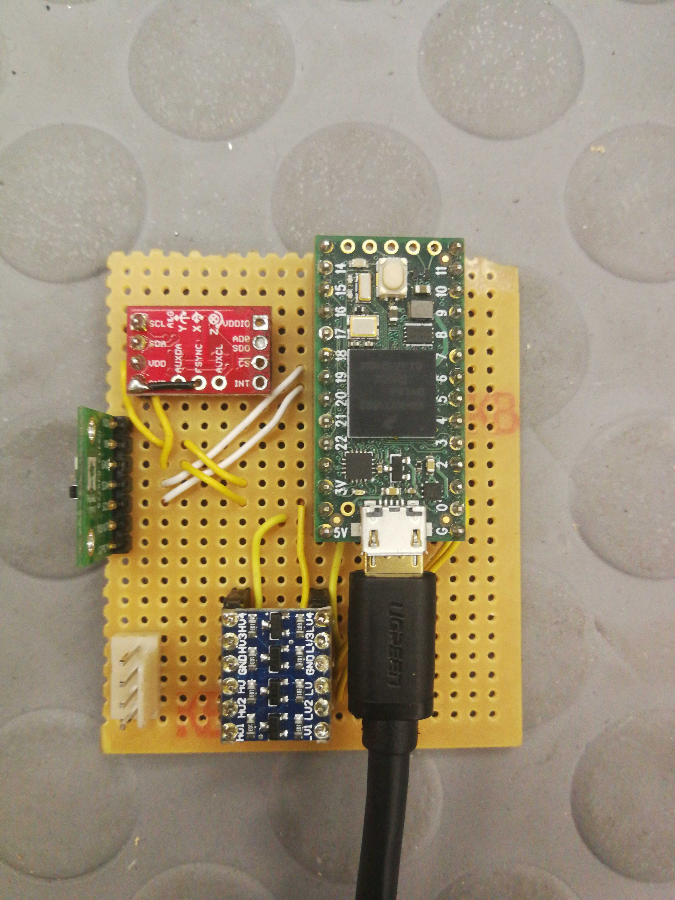

# Sensor logger

Code and documentation for the teensy logger, which forwards encoder, height and imu data to a laptop via USB 

## Components used

| Component | Voltage | Pins |
| :-------- | ------: | ---: |
| [VL53 height sensor](https://github.com/pololu/vl53l0x-arduino) | 3.3-5V | SDA -> 18, SCL -> 19 |
| [MPU-9250 imu](https://learn.sparkfun.com/tutorials/mpu-9250-hookup-guide) | 3.3V | SDA -> 17, SCL -> 16 | encoder | 5V | A -> 0, B -> 1 |
| [E6B2-CWZ3E encoder](https://www.ia.omron.com/data_pdf/cat/e6b2-c_ds_e_6_1_csm491.pdf) | 5V | A -> 0, B -> 1

Note that the values in the table could be out of date - when it doubt, look at the circuit and source code directly

## Software
Programmed using the [platform.io](https://platformio.org/) extension in vs code. See the [platformio.ini](./platformio.ini) file for dependancies, but the extension should install everything for you

The [`scripts/receive_comms.py`](./scripts/receive_comms.py) Python script has some demo code to receive data from the teensy, save it to a file and plot the result

## Contributing
Please keep this repo alive! _Don't_ update the files with code specific to your project - either copy-paste and modify, or better yet, create a branch and work in there. The `main` branch should be general purpose and simple to understand